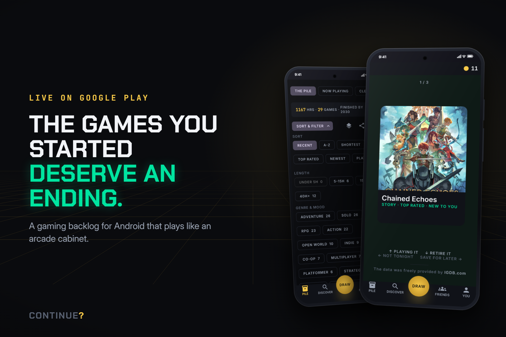
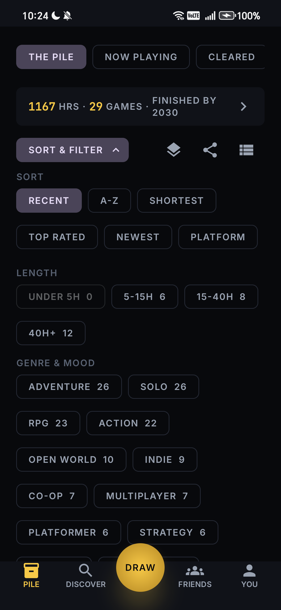
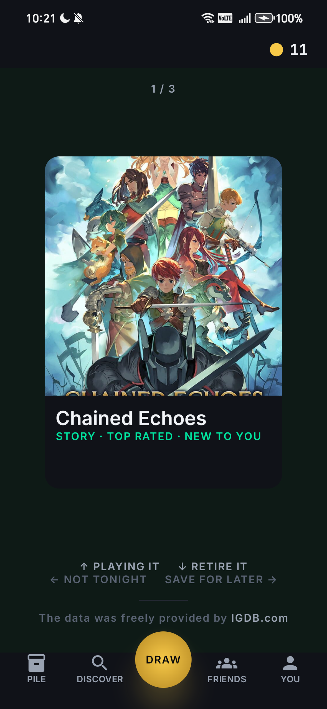
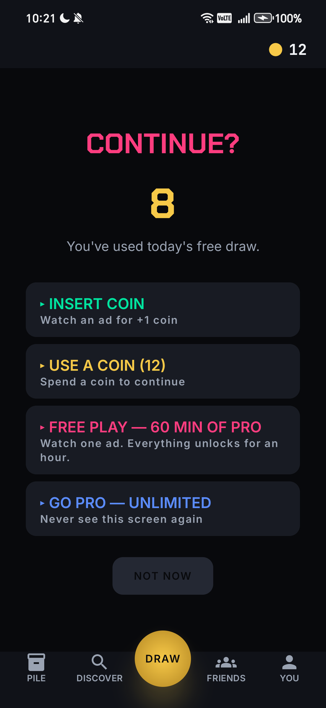
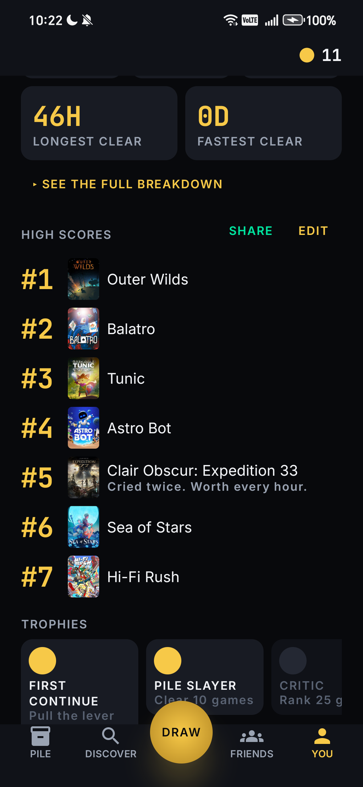

<div align="center">

# CONTINUE?

**The games you started deserve an ending.**

A gaming backlog for Android that plays like an arcade cabinet.

[**Get it on Google Play**](https://play.google.com/store/apps/details?id=com.mikhilnaika.continueapp) · MIT licence · Built solo for RevenueCat Shipaton 2026



</div>

---

## Why

Every backlog app I tried was a spreadsheet with box art, and a spreadsheet of unplayed games is a
guilt machine. A backlog isn't a storage problem, it's a **decision** problem. And the arcade
already solved the emotional side: `CONTINUE?` was never failure. It was a second chance, a
countdown and a coin.

## What it does

| | |
|---|---|
| **Save** | Share a YouTube or TikTok link, any text, or a screenshot to CONTINUE? and the game is identified, even offline (see [the matching engine](#the-share-matching-engine)). Or search IGDB in DISCOVER. |
| **Organize** | A time budget that tells the truth (*1,167 hours, 29 games, finished by 2030*) from the hours a week you actually play. One set of filters across the app, a stats screen, and a hard cap of three games in NOW PLAYING. |
| **Decide** | Set time, mood and genre, pull the lever, and three cards deal from *your own* pile with the reason each one fits. |
| **Complete** | Clearing a game rolls the credits: your own stats over the key art. Games finished before you installed can be backdated. |
| **Rate** | No stars. "Which did you enjoy more?" binary-searches each game into a personal all-time ranking. |
| **Share** | A HIGH SCORES card, and your whole pile as a signed link friends can follow, with no accounts. |

<div align="center">




</div>

## Engineering highlights

### The share-matching engine

A shared caption is never a clean title ("Elden Ring Shadow of the Erdtree is brutal"), and IGDB's
search is near-exact. So:

1. YouTube and TikTok links are expanded server-side to the video's title
   ([`resolveUrl.ts`](worker/src/resolve/resolveUrl.ts)).
2. The text becomes an ordered shortlist of candidate titles: caption filler and stopwords dropped,
   in-title connectors kept, sequel numerals folded (III ↔ 3)
   ([`GameNameCandidates.kt`](app/src/main/java/com/mikhilnaika/continueapp/core/util/GameNameCandidates.kt)).
3. Candidates are looked up in a **17,095-game index with alternative names** that ships in the APK
   (0.58 MB), built from IGDB's data dumps by [`tools/igdb_dump_index.mjs`](tools/igdb_dump_index.mjs).
   Matching needs **no network**; screenshots are read with on-device OCR (ML Kit).
4. Every match is scored against the original text: confident → one tap, ambiguous → a chooser,
   hopeless → an honest blank field.

The ranking logic exists in both TypeScript and Kotlin and is tested against the same fixture
captions, so the offline and online paths can't disagree.

### Offline-first

Room is the source of truth; the UI only reads from it and the network only fills the cache. The
pile, DRAW and share matching all work in flight mode. A Room migration test fails the build if a
schema change would crash upgrading users.

### Security on a public repo

No accounts and a public repo means **nothing secret can ship in the app**. The full threat model
is in [`docs/12-SECURITY.md`](docs/12-SECURITY.md). In short: secrets live only as Worker secrets;
three rate limiters (per IP, per expensive route, and a global cap under IGDB's own limit); input
caps; an SSRF fixed in the link resolver; and pile links signed with a per-phone ECDSA P-256 key and
carried in the URL fragment, so the server never sees them. The app requests three permissions:
internet, network state, vibrate.

### Monetization with RevenueCat

Three layers, one economy, all run by RevenueCat:

- **PRO**: Monthly (7-day trial) or Lifetime. Unlimited draws and stacks, no ads, and coin grants
  through RevenueCat's `COIN` virtual currency.
- **Coins**: earned by clearing games or watching an ad; spent to continue past the daily free draw
  or on music packs.
- **Rewarded ads, always opted into**: INSERT COIN (one coin) or FREE PLAY (60 minutes of the real
  `pro` entitlement), both **verified server-side by RevenueCat** before anything is granted.
  No interstitials, no banners. Details: [`docs/04-MONETIZATION.md`](docs/04-MONETIZATION.md).

### Sound from code

All 14 sound effects and 3 music packs are synthesised from oscillators and seeded noise by
[`tools/make_audio.py`](tools/make_audio.py) and released under CC0
([`docs/AUDIO-LICENSE.md`](docs/AUDIO-LICENSE.md)). The demo video is code too: [`video/`](video/)
is a Remotion project, scored by [`tools/make_video_score.py`](tools/make_video_score.py).

## Architecture

```
┌──────────────────────────────┐        ┌────────────────────────┐
│  Android app (Kotlin/Compose)│        │  Cloudflare Worker (TS)│
│                              │  HTTPS │                        │
│  UI ──reads──▶ Room (truth)  │───────▶│  rate limits · KV cache│──▶ IGDB
│                  ▲           │        │  link resolver (oEmbed)│
│  offline index ──┘  ML Kit   │        │  secrets live here only│
│                              │        └────────────────────────┘
│  RevenueCat SDK · AdMob · UMP│───────▶ RevenueCat (entitlements, COIN, ad verification)
└──────────────────────────────┘
```

**Stack:** Kotlin · Jetpack Compose (Material 3) · Hilt · Room · DataStore · Retrofit +
kotlinx.serialization · Coil 3 · RevenueCat `purchases-android` · Google Mobile Ads + UMP ·
ML Kit text recognition · Cloudflare Workers + KV (TypeScript) · minSdk 26, targetSdk 36.

## Build it yourself

**Requirements:** Android Studio (or the Android SDK) and JDK 21.

```bash
git clone https://github.com/Mikhil-sec/GamesToPlay.git
cd GamesToPlay
cp local.properties.example local.properties
```

In `local.properties`, set `sdk.dir` and point the app at the live backend (a public endpoint by
design):

```properties
WORKER_BASE_URL=https://continue-worker.gamestoplay.workers.dev
```

Then:

```bash
./gradlew installDebug        # build and install on a connected device or emulator
./gradlew testDebugUnitTest   # 213 unit tests
```

The **debug** build needs nothing else: it uses fake billing and ad repositories and Google's
public test ad units, so every screen works without a RevenueCat or AdMob account. (Real purchases
and RevenueCat-verified ads only exist in the Play Store build.)

**The Worker** (optional; only if you want your own backend):

```bash
cd worker
npm install
npm test                      # 75 tests
npx wrangler dev              # with no IGDB credentials it serves bundled seed data
# for real IGDB data: npx wrangler secret put TWITCH_CLIENT_ID / TWITCH_CLIENT_SECRET, then deploy
```

## Repository tour

| Path | What's there |
|---|---|
| [`app/`](app/) | The Android app. Feature-first packages: `feature/pile`, `draw`, `sharetarget`, `rank`, `friends`, `stats`, … and shared `core/` |
| [`worker/`](worker/) | The Cloudflare Worker: IGDB proxy, cache, link resolver, rate limiting |
| [`tools/`](tools/) | Offline-index builder, audio synthesiser, video score, test helpers |
| [`video/`](video/) | The demo video as code (Remotion) |
| [`docs/`](docs/) | How it was built, in the open. Start with [`10-BUILD-STATUS.md`](docs/10-BUILD-STATUS.md) (a dated log of every build, bug and fix), then [`12-SECURITY.md`](docs/12-SECURITY.md), [`08-GAME-DATA.md`](docs/08-GAME-DATA.md) and [`03-DESIGN-SYSTEM.md`](docs/03-DESIGN-SYSTEM.md) |

## Attribution

Game data and artwork are provided by [IGDB](https://www.igdb.com). *The data was freely provided
by IGDB.com.*

## Licence

Code: [MIT](LICENSE) © 2026 Mikhil Naika. Audio: CC0 ([details](docs/AUDIO-LICENSE.md)).

<div align="center">
<sub>No influencer's name, likeness or branding is used anywhere in this project.</sub>
</div>
